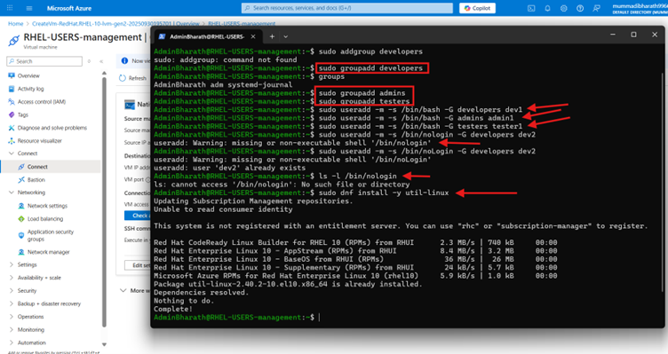
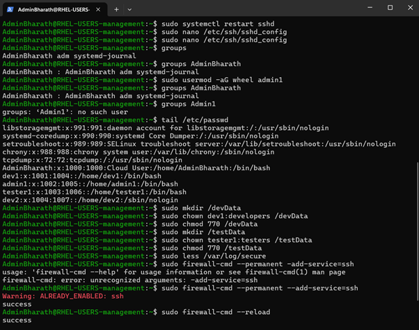
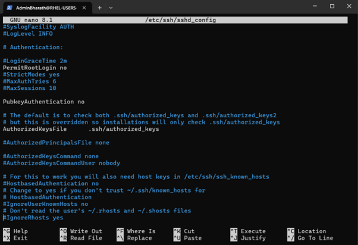

# Secure User Management System on RHEL

## Overview
This project demonstrates how to create a secure user management system on a Red Hat Enterprise Linux (RHEL) virtual machine.  
The focus is on enforcing least privilege, using SSH key-based authentication, and disabling password authentication.

## creation of VM and 
Open dhashboard of azure cloudand click on create resourse 


## Steps Implemented

### 1. User and Group Setup
Created user groups for role separation:
```bash
sudo groupadd developers
sudo groupadd admins
sudo groupadd testers
```



Created users and assigned them to groups:
```bash
sudo useradd -m -s /bin/bash -G developers dev1
sudo useradd -m -s /bin/bash -G admins admin1
sudo useradd -m -s /bin/bash -G testers tester1
sudo useradd -m -s /sbin/nologin -G developers dev2
```

Verified user creation:
```bash
id dev1
id admin1
id tester1
grep dev1 /etc/passwd
grep admin1 /etc/passwd
grep tester1 /etc/passwd
```



### 2. Sudo Rights
Configured `visudo` to give full sudo access only to the `admins` group, while restricting developers and testers to limited commands.

```plaintext
%admins ALL=(ALL) ALL
%developers ALL=/usr/bin/vi,/usr/bin/vim,/usr/bin/nano
%testers ALL=/usr/bin/vi,/usr/bin/vim,/usr/bin/nano
```

### 3. SSH Key Authentication
Generated SSH keys:
```bash
ssh-keygen -t rsa -b 4096 -C "youremail@example.com"
cat ~/.ssh/id_rsa.pub >> ~/.ssh/authorized_keys
chmod 600 ~/.ssh/authorized_keys
```

Configured `/etc/ssh/sshd_config`:
```plaintext
PermitRootLogin no
PubkeyAuthentication yes
PasswordAuthentication no
AuthorizedKeysFile .ssh/authorized_keys
```



Restarted SSH service:
```bash
sudo systemctl restart sshd
sudo systemctl status sshd
```

### 4. Directory Permissions
Created directories restricted to specific groups:
```bash
sudo mkdir /devData
sudo chown dev1:developers /devData
sudo chmod 770 /devData

sudo mkdir /testData
sudo chown tester1:testers /testData
sudo chmod 770 /testData
```


This ensures only the respective users/groups can access their data.

### 5. Firewall Hardening
Allowed only SSH traffic via firewalld:
```bash
sudo firewall-cmd --permanent --add-service=ssh
sudo firewall-cmd --reload
```

### 6. Validation
Checked authentication settings:
```bash
sudo grep -iE "PasswordAuthentication|PubkeyAuthentication" /etc/ssh/sshd_config | grep -v '^#'
```
Output:
```plaintext
PubkeyAuthentication yes
PasswordAuthentication no
```

Tried logging in:
- Password login → **Denied**
- Key-based login → **Successful**

---

## Skills Demonstrated
- Linux system administration  
- User and group management  
- SSH security (key-based login, disabling passwords)  
- File permissions and access control  
- Firewall management  
- Server hardening best practices  

---

## Next Steps
- Extend the project to integrate monitoring and logging.  
- Automate user creation and directory setup with Ansible.  
- Apply similar principles to a multi-tier setup (DB + App server).  

